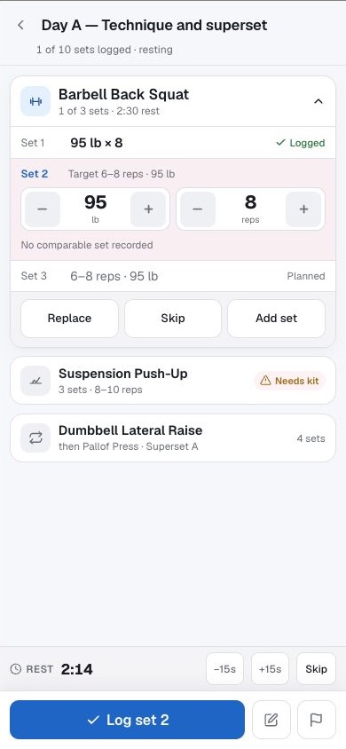
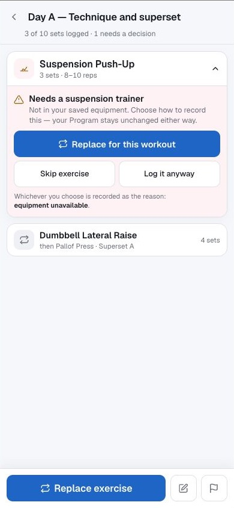
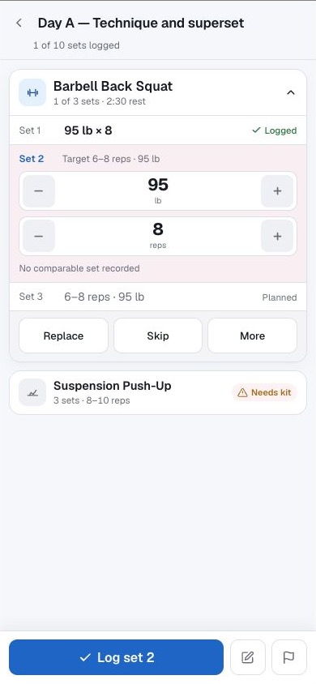
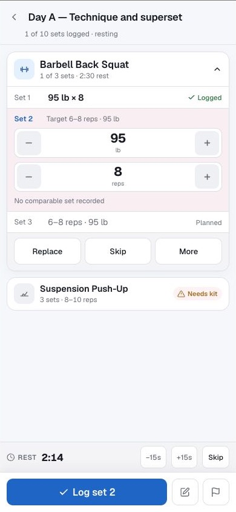
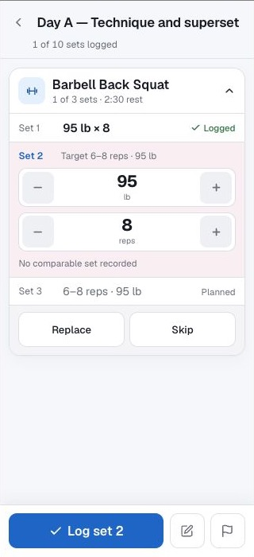

# Active Workout North Star and implementation contract

Status: approved product and visual direction; implementation is phased and
must not be represented as complete until the acceptance gates in this document
pass.

This document is the durable North Star for Repbook's active-workout
experience. It owns the intended visual hierarchy, interaction rules, state
coverage, implementation sequence, and acceptance bar. The checked-in
artboards are the visual reference. The written contract below is authoritative
where mockup copy or a static state conflicts with a product, data, recovery, or
accessibility requirement.

[`ARCHITECTURE.md`](ARCHITECTURE.md) remains authoritative for the runtime that
exists today. Each implementation phase must update that document when the
landed behaviour changes a current contract. Source and tests, not this plan,
prove which phases are actually implemented.

The original design workspace is retained as supplementary provenance at
[Claude Artifact](https://claude.ai/code/artifact/ef717d18-2bdc-4af9-9901-53e4d34dffa2).
It may require access or disappear. Repbook must never depend on that link to
recover the direction: the reference renders and the decisions that matter are
stored here.

## North Star

During a workout, Repbook should answer four questions without making the
athlete hunt:

1. What am I doing now?
2. What do I need to enter or decide?
3. What has Repbook safely recorded?
4. What happens next?

The experience should feel like **more capability with less app**. The current
exercise and current action own the screen. Completed and future work remain
visible in a compact ledger. Rest is useful context, not a modal interruption.
Recovery and equipment problems become prominent only when a decision is
actually required.

Visual calm must not be purchased by hiding truth. Planned targets, prior
results, locally retained writes, acknowledged performed work, corrections,
skips, substitutions, and unknowns remain distinct.

## Non-negotiable product contracts

The visual work must preserve these existing Repbook principles:

- The immutable occurrence ledger remains the only source of canonical current
  and next work. The UI must not invent a second sequence or progress model.
- A locally durable command may advance the athlete-facing projection before
  server acknowledgement, but it is not displayed as saved performed history
  until acknowledgement.
- Failed writes remain visible and recoverable. No optimistic state may silently
  disappear, become a zero, or look saved.
- A Program is intent; the active workout and completed History are evidence.
  Workout-only changes do not silently edit the Program.
- Exact exercise and equipment variants remain distinct. A visually similar
  item is not automatically compatible.
- Rest duration is neutral training context. It is not adherence, failure, or a
  warning.
- A technical interruption is separate from athlete adherence. Unknown causes
  remain unknown.
- Age alone does not create a restriction. Pain and other safety evidence keep
  their existing explicit, owner-controlled contracts.
- Consequential Program changes remain proposals until the owner approves them.
- Completed history is never rewritten merely to make the new interface look
  consistent.

## Decisions already settled by source review

Do not reopen these as speculative defects during implementation:

- The current next-up starting-load value is already scoped from the next
  member's data. The remaining work is clearer visual and accessible label
  ownership, not a data-mapping rewrite.
- The development sign-in form is environment-gated and does not render in
  ordinary production. This tranche must not invent a production login-removal
  task. Device-only diagnostics may be relocated if they compete with the
  active-workout hierarchy, but their privacy and retention contracts remain.
- The workout-set outbox already has stable client identities, durable local
  retention, and ordering safeguards. Overlapping same-exercise writes still
  need the explicit interaction-level proof in Phase 0 before the new UI relies
  on them.
- The session-exercise schema already contains skip, substitution, original-
  exercise, and substitution-time fields. Do not add parallel reason columns.
  The likely persistence work is a narrowly additive reason value plus writer,
  reader, version, and lifecycle coverage, but the Phase 4 verification query
  decides the smallest correct change.
- Hiding narrow-screen steppers at 145% text is current deliberate CSS, not a
  rendering failure. The approved direction deliberately changes that trade:
  stack the measures and retain the controls.

These conclusions prevent the visual tranche from expanding into an unrelated
authentication, data-remapping, or state-management rewrite.

## Visual reference

The artboards use the actual Repbook foundation: Geist, the existing OKLCH
palette, `--radius: 0.65rem`, `--touch: 2.75rem`, and the current inset,
selected, and attention surfaces. They are static arguments for hierarchy and
layout budget, not screenshots of implemented behaviour.

### Default text: 390 by 844

| Set entry | Rest running |
|---|---|
|  |  |

| Rest complete | Equipment decision |
|---|---|
|  |  |

### Extra-large text and narrow stress case

| Set entry: 390 by 844 at 145% | Rest: 390 by 844 at 145% |
|---|---|
|  |  |

| Stress case: 320 by 700 at 145% |
|---|
|  |

The 320 by 700 artboard intentionally lets the next-up content fall below the
fold. That trade is acceptable only while the exact next action remains
truthful and reachable in the fixed action area, focused content is never
obscured, and the user can scroll to all supporting content.

## Corrections to the static mockups

These decisions supersede any conflicting wording shown in an artboard:

| Mockup or shorthand | Required product wording or behaviour |
|---|---|
| `Skip` on a running rest | Use **End rest**. This records an explicit rest outcome; it does not imply skipping planned work. |
| `Needs kit` | Use **Needs equipment**, or the more exact **Equipment unavailable** when that cause is known. |
| `Log it anyway` | Do not use this ambiguous bypass label. When no reviewed setup or compatible choice can be resolved, preserve the existing truthful **Log set** path: record the displayed load with `legacy_unknown` meaning and no equipment snapshot. Never turn that explicit unknown into a claimed equipment fact. |
| Generic equipment conflict | Offer only actions justified by the known state: **Choose equipment** when a compatible item exists but is unselected; otherwise **Replace for today** and **Skip exercise**. |
| Permanent rest-complete card | Announce completion politely, show the compact confirmation for four seconds, then collapse it automatically. No dismiss action is required. |
| Unlabelled note or finish icons | Every icon-only control needs a visible tooltip where supported and an exact accessible name. Prefer visible text for **Finish** because it is consequential. |

Amber means that a decision or recovery action needs attention. It does not
mean rest, replacement, selected, or merely notable. Neutral surfaces carry
ordinary context and active rest. Green is reserved for acknowledged success or
a brief completed state; colour is never the only status signal.

## Information architecture

### 1. Workout header

The header is compact and stable. It contains the workout identity, elapsed
active duration, progress derived from the occurrence ledger, and access to
secondary workout context. It must not compete with the current set.

Elapsed duration remains descriptive. It must never be presented as evidence
that planned work was or was not completed.

### 2. Current exercise

The current exercise is the primary landmark. It includes, in this order:

1. exercise identity and exact variant;
2. current set position and prescribed target;
3. the compact set ledger;
4. the editable current row;
5. exact save or recovery state;
6. optional details such as effort, technique, limitation, pain, and notes;
7. workout-only replace, skip, add-set, and supporting guidance actions.

The common path must not require opening optional disclosures.

### 3. Compact set ledger

The set ledger replaces the visually isolated current-set card. It is a single
view over the existing occurrences and completed sets, not a new data store.

- Completed sets collapse to one readable row, such as `95 lb × 8 · Saved`.
- The current set expands into the only ordinary editable row.
- Later sets show their planned target without looking performed.
- Prior comparable performance may appear as supporting context, explicitly
  labelled **Previous**, never as today's result.
- The ledger exposes enough state to answer what was missed without requiring
  the full History ledger.
- Optional metrics stay out of the compact row unless the athlete opens the
  details for that set.

### 4. Rest strip

Rest appears as a neutral strip directly above the fixed action area. It uses
about one compact row of vertical space. While it runs:

- the next current set remains visible and editable;
- the primary Log set action remains available when the write contracts permit
  it;
- the destination is exact, including group member and round where applicable;
- `-15`, `+15`, and **End rest** remain at least 44 CSS pixels in both
  dimensions;
- a cue-channel failure is stated as a cue problem, not as a failed rest or
  athlete failure.

Ending or completing rest must not mutate a set occurrence. Rest durability,
ordering, cross-tab ownership, and cue idempotency retain their current source
contracts even though the presentation becomes nonblocking.

### 5. Fixed action area

The fixed action area is the single reliable home for the primary next action,
note entry, and Finish access. Its content changes truthfully with state:

- `Log set 2` for an editable current set;
- `Saving set 1…` or a compact retained-state indicator for the affected row,
  without falsely labelling it saved;
- `Review save problem` when a blocker needs recovery;
- `Choose equipment`, `Replace for today`, or `Skip exercise` only when that is
  the actual required decision;
- `Review and finish` while unresolved planned work remains;
- `Finish workout` only when the completion contract is satisfied.

The fixed area must never cover the active field, focused control, failure
message, or the last reachable document content. Its measured height must feed
the existing overlay offset and safe-area calculation.

### 6. Next-up context

Next-up cards remain concise and below the current exercise. They preserve
exact exercise identity, group order, required equipment, and a read-only
starting-load preview. The preview belongs visually and semantically to the
named next member. Missing load evidence is shown as missing, not zero.

For a group, use exact sequencing such as `Superset A · next Pallof Press`, not
a generic `Next` that loses the member relationship.

## Canonical UI state model

The state tables are an implementation checklist. Every reachable state needs
one visual treatment, one accessibility treatment, and one explicit set of
allowed actions.

### Set-row states

| State | Required presentation | Allowed actions and constraints |
|---|---|---|
| Planned | Set number and frozen prescription in subdued text | No performed claim; may become current only from ledger order |
| Current/editable | Expanded row with exact measure, unit, target, and input controls | One ordinary Log set action; optional details and explicit skip remain secondary |
| Locally retained | Entered result remains visible with **Unsaved on this device** or **Pending** | Projection may advance only after the command is durable locally |
| Saving/retrying | Row remains visible with a nonblocking live status | Do not clear inputs, invent acknowledgement, or allow unsafe conflicting mutation |
| Failed/needs attention | Attention surface with exact retained result and failure text | **Retry save** and explicit **Discard device copy**; discard restores the occurrence and never looks like a completed set |
| Saved | Collapsed performed result with **Saved**, plus a concise correction or restore marker when revision provenance exists | Revision provenance remains independent from save lifecycle; earlier versions remain inspectable and recoverable under existing authorization rules; no duplicate ordinary commit action |
| Skipped | **Skipped** plus the known structured reason | Restore, replace-for-today, or continue only where the existing occurrence contract permits |
| Extra/added | Label as extra or workout-only; never imply Program membership | Same save, failure, correction, and recovery states as planned sets |
| Unknown/legacy | Explicit unavailable or unsupported message | Do not infer target, unit, equipment, or reason from current metadata |

### Rest states

| State | Required presentation | Behaviour |
|---|---|---|
| Inactive | No rest strip | Current action owns the space |
| Running | Neutral countdown, destination, cue mode, `-15`, `+15`, **End rest** | Next set remains editable; remaining time derives from the absolute deadline |
| Ended by athlete | Brief neutral confirmation with the exact destination | Records explicit rest outcome without implying skipped exercise work |
| Time elapsed | Brief success confirmation and polite announcement | Collapses after four seconds without a dismiss control |
| Cue blocked/unavailable | Countdown remains valid; cue limitation is written plainly | Visual timer continues; no false sound or vibration claim |
| Recovery required | Attention surface names the retained timer problem | Recovery action must not cover or silently change the current set |

### Equipment states

| State | Required presentation | Available action |
|---|---|---|
| Ready and confirmed | Compact exact equipment label or no interruption in the common path | Log with the confirmed snapshot |
| Compatible but unselected | **Choose equipment** | Open the existing equipment-selection flow; do not log until selection is durable |
| Configuration incomplete | Name the missing configuration | Complete setup or choose a different compatible item |
| Unavailable | **Equipment unavailable** | **Replace for today** or **Skip exercise**; retain the reason |
| Incompatible | Name the exact incompatibility | Choose a compatible item, replace for today, or skip; no bypass |
| Unknown/legacy with no reviewed setup or compatible choice | **Equipment status unknown** without inventing a conflict | Keep **Log set** available; persist the displayed load with `legacy_unknown` meaning and no equipment snapshot |
| Selection pending/failed | Keep the device copy and exact status visible | Retry or deliberately discard through the existing equipment queue; equipment guidance alone never blocks Finish |

### Session-level states

The complete experience must cover preparation, structured warm-up, ordinary
set entry, set save pending, rest running, rest complete, equipment decision,
skip/replace decision, correction, offline retention, failure recovery,
superset member and round transitions, early-finish review, ready-to-finish,
completion pending, and completed-session handoff.

No state may strand the athlete with only a colour, spinner, toast, or ambiguous
icon as its explanation.

## Interaction contracts

### Post-action focus and keyboard safety

After a successful Log set action, focus must move to a stable heading or the
new current row. It must never land on a decrement or increment control. A
stray Enter key after logging must not change weight, repetitions, time,
distance, or another recorded value.

For a failed write, focus moves to the recovery heading or alert. After retry,
it returns to the affected row. Opening a drawer or dialog follows the existing
focus trap and return-focus rules.

This keyboard contract is a release gate, not cosmetic accessibility polish.

### Steppers and editable measures

The existing extra-large text rule that hides `.active-set-stepper` at narrow
widths is replaced by a layout rule. Weight and repetitions stack when needed;
their step controls remain present, labelled, and reachable at 145% text.

The implementation must preserve the metric type:

- repetition work exposes repetitions;
- timed work exposes duration;
- distance work exposes distance and unit;
- hold or other supported measures keep their established meaning;
- a missing or unsupported measure remains explicit rather than falling back
  to repetitions or zero.

### Rapid actions, offline work, and ordering

The visual design does not loosen queue safety. Before enabling two consecutive
logs on the same exercise while the first is unacknowledged, tests must prove
stable client identities, durable append, exact occurrence ownership,
per-exercise ordering, retry ordering, reload recovery, and duplicate
idempotency.

Once that contract is proved, rest may run while the next set is edited and
logged. If a retained blocker makes another write unsafe, the primary action
must explain the blocker instead of accepting a command that cannot be ordered.

### Equipment decisions and evidence

The equipment-decision artboard is a visual direction, not authority to invent
equipment facts. The implementation must distinguish:

- a compatible owned item that merely needs selection;
- an incomplete configuration;
- temporary occupancy (`equipment_busy`);
- equipment absent from the inventory;
- a known incompatible item or setup;
- unknown legacy evidence.

Unknown is a supported truthful state, not an error that traps set entry. When
the existing resolver finds no reviewed setup or compatible choice, **Log set**
remains available and records the displayed load with `legacy_unknown` meaning
and a null equipment snapshot. That is not the artboard's ambiguous `Log it
anyway` bypass: it makes no claim about what equipment was used. A known
unavailable or incompatible state must not be relabelled unknown merely to
avoid its decision flow.

Substitution and skip reasons must survive the write, History/Review, export,
snapshot, restore, record-version restore, and reporting paths that claim to
represent them. Do not use `equipment_busy` for equipment that is absent. Do
not use `other` to hide a known unavailable cause.

Before any schema change, verify the current rows and version payloads with
representative data. Use the smallest additive semantic change that represents
the proven states. Never edit an applied migration and never backfill historical
records from current equipment settings. If earlier evidence cannot prove a
cause, it remains unknown.

### Skip, replacement, and Program boundary

**Replace for today** changes only the active workout. **Skip exercise** records
the workout outcome and its reason. Neither action edits the Program. Any
future Program adaptation remains a separate, explicit, owner-approved flow.

When a confirmed skip is being reconciled, keep the exercise visibly open until
the owner restores it, replaces it, or deliberately continues without it.
Technical failure during the transition must stay separate from the athlete's
reason.

### Finish

Finish remains a deliberate action. If planned occurrences remain, the athlete
reviews them and chooses one truthful session-level reason under the existing
bulk completion contract. Pending or failed recorded-work commands and an
unconfirmed skip continue to block completion until their outcome is known.
Pending, failed, or unreadable equipment-selection commands are guidance for a
future set, not recorded performed work; surface them informationally, but
never let equipment guidance alone block Finish or trap the workout.

## Responsive and accessibility acceptance

The reference sizes are minimum named gates, not the entire supported matrix.

| Dimension | Required coverage |
|---|---|
| Text size | 100%, 115%, 130%, and 145% application settings |
| Mobile portrait | 390×844 at 115% and 145%; 320×700 at 145% |
| Mobile landscape | 844×390 and a narrow-height equivalent with the on-screen keyboard considered |
| Larger layouts | Current tablet and desktop reference projects |
| Colour scheme | Light and dark |
| Input | Touch, mouse, keyboard, and software-keyboard viewport changes |
| Motion | Normal and `prefers-reduced-motion` |

Every phase must preserve:

- semantic headings, regions, tables or lists as appropriate;
- exact accessible names and relationships;
- visible focus and logical DOM/tab order;
- 44-by-44 CSS-pixel minimum touch targets;
- sufficient contrast for text, controls, borders, and state surfaces;
- status and alert announcements that do not chatter on every countdown tick;
- no horizontal page overflow;
- safe-area insets and measured bottom-overlay spacing;
- reveal-and-focus behaviour that accounts for the visual viewport and
  on-screen keyboard;
- usable content at 145% text rather than hidden essential controls.

Automated accessibility and WebKit checks are required. The established
installed-iPhone PWA and VoiceOver field check remains a release gate unless
the owner explicitly changes that public requirement; passing desktop browser
semantics alone is not equivalent evidence.

## Implementation architecture

The implementation should be incremental. It must not replace the occurrence
ledger, add a competing client state store, or rewrite the large session
components wholesale.

### Presentation boundary

Create a pure view-model projection for the active exercise ledger. It receives
existing session exercise, occurrence, completed-set, local outbox, and save
runtime evidence and returns typed rows. It does not write, reorder, infer
equipment, or mutate server data.

Build the visual ledger as a focused component composed into the current
exercise card. Preserve existing action handlers during the first tranche. The
component API should make every row state exhaustive so a new save or outcome
state cannot silently fall through to a saved-looking default.

### Session orchestration boundary

`session-runner` continues to own current-action derivation, disclosure,
scrolling, focus handoff, and session-level transitions. Add one explicit
post-commit focus target rather than searching for the first focusable control
inside a newly rendered row.

### Fixed action and rest boundary

`workout-status-bar` continues to own its measured overlay height and the sole
session-level Finish access. Refactor `rest-cockpit` into the compact strip and
compose it alongside, rather than instead of, the current-set action. The rest
timer service and its durable stores remain unchanged unless a failing contract
test proves a required service defect.

### Equipment boundary

Reuse the existing selection, setup, replacement, skip, and device-queue
writers. The decision surface routes to those writers; it does not introduce a
fourth equipment mutation path. Any new persisted reason must participate in
the complete lifecycle inventory before its migration can be accepted.

### Styling boundary

Use the existing design tokens and component primitives. Replace the narrow
extra-large-text stepper hiding rule with container or grid layout. Avoid
fixed-height content containers, viewport assumptions, and one-off colours.

## Phased implementation plan

Each phase is a separate reviewable pull request unless adjacent phases are
small enough that combining them demonstrably improves safety. A phase is not
complete because its screenshot looks right; it must satisfy its state and
regression gates.

### Phase 0 — lock the contract and test harness

Objective: make the intended states executable before changing the main UI.

Work:

- add a typed active-set row projection and exhaustive unit fixtures;
- add synthetic fixtures for every state in the tables above;
- add deterministic time control for rest-running and four-second rest-complete
  states;
- add screenshot names for the seven checked-in references plus missing hard
  states;
- add the keyboard regression that proves Enter after Log set cannot change a
  measure;
- prove current outbox ordering for two rapid same-exercise writes, offline
  reload, retry, and duplicate acknowledgement;
- record baseline screenshots from the current implementation for comparison,
  without treating them as the target.

Exit gate: the state inventory is exhaustive, the keyboard regression fails for
the known unsafe focus behaviour, and existing ordering tests prove or clearly
bound the rapid-log contract.

Phase 0 evidence lives with the executable contract rather than in a second
planning document:

- `src/lib/active-set-row-projection.ts` projects immutable occurrence, saved
  result, local outbox, and revision evidence into exhaustive typed rows. Set
  membership such as extra or workout-only and revision provenance such as
  corrected or restored remain independent from save lifecycle.
- `src/lib/active-workout-presentation-state.ts` names the rest, equipment, and
  session presentation states without writing data or parsing human-readable
  messages into facts. Missing rest-cue capability remains unknown and fails
  closed to recovery instead of being assumed available.
- `tests/fixtures/active-workout-north-star.ts` supplies one typed fixture for
  every state plus cross-axis combinations that prevent extra, failed,
  corrected, restored, and unknown evidence from collapsing into each other.
- `tests/unit/workout-set-outbox-sync.test.ts` proves two rapid writes to the
  same exercise survive offline retention, reload, ordered retry, a locally
  failed acknowledgement cleanup, duplicate acknowledgement, and final
  delivery without changing the production writer.
- `docs/assets/active-workout-phase0-baseline/` records the seven current-state
  comparison screens and the current keyboard failure using disposable
  synthetic data. These images are not the target artboards.
- `npm run test:e2e:active-workout-north-star` exercises the current baseline
  scenarios and the isolated equipment-decision fixture, producing fresh
  screenshots for inspection rather than pixel-diffing the checked-in evidence.
  Its keyboard scenario is an explicit expected failure while Phase 0
  characterizes the unsafe focus handoff. When Phase 2 fixes the defect, that
  unexpected pass is the signal to remove the expected-failure annotation and
  keep the scenario as a release gate.

Phase 0 changes presentation contracts, fixtures, and verification only. It
does not change the active-workout UI, runtime writers, persistence, schema,
historical records, equipment inventory, or production data.

### Phase 1 — compact set ledger

Objective: replace the isolated current-set card with the compact ledger while
leaving writers and persistence unchanged.

Work:

- render completed, current, future, extra, skipped, corrected, retained, and
  unknown rows from the projection;
- move the existing inputs and Log set handler into the current row;
- keep prescribed, previous, and performed values visibly distinct;
- retain optional details, notes, effort, pain, skip, and add-set access below
  the common path;
- preserve exact metric, load, unit, plate, unilateral, and equipment snapshot
  semantics;
- update component and browser tests that currently assert rest removes the
  active set or that the current set is a separate card.

Exit gate: all row states are truthful, existing recording and correction
tests pass, and the default set-entry screen matches the reference hierarchy at
390×844 without deleting existing capabilities.

Phase 1 implementation evidence remains reviewable with the code instead of
creating another overlapping plan:

- `src/components/session/active-set-ledger.tsx` renders the Phase 0 projection
  exhaustively. Membership such as extra or workout-only, acknowledgement
  lifecycle, and correction or restore provenance remain independent labels.
- `src/components/session/exercise-card.tsx` places the existing performed-
  value controls, Log set handler, recovery controls, optional details, skip,
  and add-set behavior inside the appropriate ledger row. It does not introduce
  a second ordering model or change any writer.
- The newest immutable correction or restore action owns each ledger and prior
  comparable revision label, while a separate change count retains the full
  lineage. Retained device rows and Unknown rows keep their exact effort, note,
  technique, limitation, and pain evidence visible.
- A substituted exercise keeps the planned repetition range without inheriting
  the original movement's load, prior comparison, or set-note cue. Starting-load
  and comparison evidence must match the current exercise's stable identity.
  Unsupported or ambiguously linked results remain Unknown and stay out of
  acknowledged Completed-set controls. The direct Replace action is available
  only before set evidence exists.
- Component fixtures cover every row state, including unknown evidence and an
  editable extra set that does not displace the planned current set. Existing
  recording-truth, correction, hierarchy, recovery, equipment, import, and
  group-order browser suites exercise the integrated flow in Chromium and
  WebKit.
- `design-qa.md` and `docs/assets/active-workout-phase1-qa/` retain the exact
  390×844 default-text implementation and source comparisons. The comparison
  accepts only the compact-ledger scope; it leaves fixed action and large-text
  steppers to Phase 2 and nonblocking rest to Phase 3.

Phase 1 changes presentation and tests only. It adds no schema or migration,
rewrites no history, and does not change the outbox, acknowledgement,
equipment-snapshot, import/export, recovery, Coach, Program, or production-data
contracts.

### Phase 2 — fixed action, focus, and large-text layout

Objective: make the primary action and post-action handoff safe at every named
size.

Work:

- give the fixed area one truthful primary action for the current state;
- implement an explicit post-log focus target on the updated or next row;
- replace hidden narrow-screen steppers with stacked controls;
- preserve measured overlay, safe-area, scroll padding, visual-viewport, and
  software-keyboard clearance;
- verify note and Finish names, touch targets, focus order, and destructive
  review language.

Exit gate: the stray-Enter regression passes; all essential controls remain
visible at 145%; no named viewport overflows; focused fields and recovery
messages remain above the fixed area and software keyboard.

Phase 2 implementation evidence remains reviewable with the code:

- The fixed **Log set N** control submits the exact current ledger row through
  an HTML form association. The existing exercise-card handler, occurrence
  identity, synchronous duplicate guard, queue, and writer remain authoritative;
  no second save path was introduced.
- Post-log and post-rest focus lands on an explicit, inert rest or current-row
  target. Each exact current-set form remounts its fixed submit control; on a
  direct no-rest transition, focus leaves that replaced control for the new row
  before acknowledgement, so a repeated Enter cannot submit the next set's
  prefilled values. A failed retained write gives focus to its recovery alert.
  A focused current row or field is re-revealed after text-size, window, or
  visual-viewport changes without focusing a decrement or increment control.
- The extra-large narrow-screen rule stacks measure and load-provenance rows;
  it no longer hides `.active-set-stepper` controls or truncates the starting-
  load source.
- The measured fixed-area height continues to own bottom content and device-
  queue offsets. The workout content padding consumes that measured value with
  safe-area fallback instead of duplicating a guessed fixed height.
- The North Star browser contract now proves the stray-Enter invariant, exact
  action names, 44-pixel stepper targets, fixed-area clearance, and no
  horizontal overflow at 390×844 and 320×700 with 145% text. The execution and
  hierarchy suites additionally prove a held no-rest acknowledgement cannot
  turn a second Enter into another write and a failed retained save owns focus.
- `design-qa.md` and `docs/assets/active-workout-phase2-qa/` retain equal-size
  source/implementation comparisons for the named Phase 2 viewports. Neutral
  nonblocking rest remains Phase 3; equipment decisions and persisted reasons
  remain Phase 4.

Phase 2 changes presentation, focus orchestration, and tests only. It adds no
schema or migration, rewrites no history, and does not change set, outbox,
acknowledgement, equipment-snapshot, import/export, recovery, Coach, Program,
or production-data contracts.

### Phase 3 — neutral, nonblocking rest

Objective: make rest informative without taking the next set away.

Work:

- render the neutral compact rest strip above the fixed action area;
- keep the next current set editable and, when queue safety permits, loggable;
- rename the explicit action **End rest**;
- implement the four-second rest-complete confirmation and single polite
  announcement;
- retain exact destination, group order, timer deadline, cue state, cross-tab
  ownership, acknowledgement enrichment, and replay protection;
- distinguish cue failure from timer failure and athlete behaviour.

Exit gate: the set-entry and rest artboards match at 115% and 145%; rest does
not block safe set entry; all existing rest durability, timing, reload, and
ordering suites pass.

Phase 3 implementation evidence remains reviewable with the code:

- `src/components/session/rest-cockpit.tsx` renders running rest as a compact
  neutral strip with countdown, cue state, exact destination, **−15s**,
  **+15s**, and **End rest**. Elapsed rest uses a brief green confirmation;
  athlete-ended rest stays neutral and does not imply skipped exercise work.
- `src/components/session/workout-status-bar.tsx` composes rest above the
  existing fixed action instead of replacing it. The exact current form remains
  safely loggable through the established form association, queue, occurrence,
  and writer. The four-second confirmation derives from the durable timer's
  absolute `readyAt` value and collapses without a dismiss action.
- `src/components/session/session-runner.tsx` keeps the timer destination as
  the current action and ledger row while rest is active. Existing measured-
  overlay and focus-preservation logic re-reveals that row after text-size or
  viewport changes without adding another state store.
- Elapsed completion owns one polite atomic status announcement. Running and
  athlete-ended states do not announce completion. Existing blocked and
  unavailable cue outcomes remain technical channel states, separate from
  timer success and athlete behaviour.
- The dedicated North Star production-build browser gate covers set entry,
  running rest, four-second completion, exact destination, enabled inputs,
  fixed **Log set 2**, touch targets, overflow, and 115%/145% captures. The
  focused Stage 5 durability scenario additionally covers deadline adjustment,
  reload while running, elapsed collapse, durable continuation, and replay-safe
  reload.
- `design-qa.md` and `docs/assets/active-workout-phase3-qa/` retain equal-size
  source/implementation comparisons for set entry and rest at the named Phase
  3 viewports. The real product keeps exact cue, destination, and supporting
  workout context that the static artboards abbreviate.

Phase 3 changes presentation, focus orchestration, and tests only. It adds no
schema or migration, rewrites no history, and does not change timer storage,
set or outbox writers, acknowledgement, equipment-snapshot, import/export,
recovery, Coach, Program, or production-data contracts. Equipment decision and
reason integrity remain the separately gated high-risk Phase 4.

### Phase 4 — equipment decision and reason integrity

Objective: make the attention state actionable without fabricating equipment or
reason evidence.

This phase affects persisted meaning and is therefore high-risk.

Work:

1. Run read-only verification against representative disposable and owner-
   approved preview data to establish what `skip_reason`,
   `substitution_reason`, occurrence resolution evidence, and
   `record_versions.before_data` actually retain.
2. Define one state-to-reason matrix for busy, unavailable, incompatible,
   unknown, and user choice. Keep busy separate from unavailable.
3. If current enums cannot represent the proven state, add the smallest
   additive migration. Never edit an applied migration.
4. Preserve the reason through every active-workout substitution and skip
   writer. Do not clear a still-relevant reason as a side effect of replacing
   the exercise.
5. Read the retained evidence in History/Review. Do not derive historical cause
   from today's inventory.
6. Include any newly claimed evidence in export, canonical snapshot, restore,
   record-version restore, privacy filtering, and recovery-manifest contracts,
   with omission and round-trip tests.
7. Build the decision surface using **Choose equipment**, **Replace for today**,
   and **Skip exercise** according to the exact known state. Preserve the
   existing `log_displayed_unknown` path when no reviewed setup or compatible
   choice can be resolved, and prove it stores `legacy_unknown` with no
   equipment snapshot. Never relabel a known conflict as unknown or fabricate
   performed-equipment evidence.

Exit gate: no historical rewrite or speculative backfill; migration is
additive and idempotent; preview upgrade and restore tests pass; each cause
round-trips or remains explicitly unknown; the equipment artboard matches the
approved hierarchy with the corrected action language.

### Phase 5 — complete active-workout state coverage

Objective: carry the North Star through the whole workout, not only the primary
mockup.

Work:

- superset and circuit member/round transitions with exact next-member text;
- warm-up to working-set transition;
- offline, saving, retrying, failed, discard, and reload recovery;
- set correction, record-version restore, added set, and workout-only exercise;
- skip, replace, continue-without-replacement, and technical failure;
- note capture and pain/exception disclosures;
- finish review, unfinished-reason capture, completion pending, and completed
  handoff;
- light/dark and reduced-motion consistency.

Exit gate: every session-level state in this document has unit and browser
evidence, no state strands the athlete, and no secondary flow reintroduces the
old isolated-card hierarchy.

### Phase 6 — integration Gauntlet and release readiness

Objective: compare the real complete workout against the North Star and find
cross-phase regressions before release.

Use a Gauntlet Loop for this phase. The concrete quality bar is:

- the seven checked-in artboards and written corrections;
- the complete state matrix in this document;
- exact occurrence, outbox, rest, equipment, correction, and Finish contracts;
- the named viewport, text-size, keyboard, recovery, and accessibility gates;
- no regression in existing recording truth, History, export, snapshot,
  restore, or Program ownership.

Fresh-context critics inspect the running product and actual test evidence, not
the implementer's explanation. Each loop identifies the largest remaining
material gap, fixes it, and reruns affected checks until the bar is met or the
owner stops the loop.

Exit gate: integration review finds no material contract gap; protected checks
are green; preview and physical-device acceptance are complete; release notes
state any real limitation rather than hiding it.

## Verification matrix

### Focused automated checks

The implementation should extend, not replace, the established suites:

| Contract | Existing gate to retain or extend |
|---|---|
| Occurrence ordering and locally durable advance | `npm run test:e2e:v2-t02` |
| Current/next/group/rest truth | `npm run test:e2e:v2-t05` |
| Active-workout hierarchy | `npm run test:e2e:v2-u01` |
| Complete live-workout stress case | `npm run test:e2e:v2-gauntlet-b` |
| Timing, interruption, and recovery | `npm run test:e2e:post-v2-p1-timing` |
| Failed retained set recovery | `npm run test:e2e:failed-set-recovery` |
| Mobile replacement and keyboard clearance | `npm run test:e2e:replacement-mobile` |
| Superset preparation and exact next member | `npm run test:e2e:superset-prep` |
| Current action and mobile calibration | `npm run test:e2e:current-action` |
| Test-selection completeness | `npm run test:selection` and `npm run ci:browser-groups:check` |

Add a dedicated North Star Playwright project rather than overloading one
historical milestone spec. Its scenarios should use synthetic data and capture
all seven references plus saving, failed, keyboard, landscape, superset,
correction, skip/replace, and finish-review states.

### Per-phase engineering checks

For each application phase:

```bash
npm run lint
npm run typecheck
npm run test
npm run build
npm run docs:check
```

Run the focused browser suites affected by that phase before the complete
protected CI matrix. A data phase also requires:

```bash
npm run db:verify
npm run db:verify-production-upgrade
npm run test:integration:postgres
```

Do not report a named check as passed unless it ran against the exact candidate
commit.

### Manual acceptance script

Use a representative full workout containing a straight-set exercise, a
superset, more than one equipment variant, at least one timed or non-repetition
measure, and an exercise that can be replaced. Verify:

1. Start or resume the workout and identify the current and next actions.
2. Log two sets rapidly, including while rest runs, then reload offline and
   online.
3. Confirm pending, saved, retry, failed, and explicit discard states are
   truthful.
4. End one rest early and let another expire; confirm neither is treated as
   adherence failure.
5. Navigate the complete set-entry path using keyboard and Enter; confirm focus
   never lands on a value-changing control after logging.
6. Exercise compatible-unselected, unavailable, incompatible, and unknown
   equipment states; confirm the first three expose only truthful actions and
   the unknown path can log with `legacy_unknown` and no equipment snapshot.
7. Replace one exercise for today and skip another with a reason; confirm the
   Program remains unchanged and History/Review retains the truth.
8. Correct a saved set and inspect the earlier version.
9. Complete the superset and confirm exact member and round sequencing.
10. Open the software keyboard in portrait and landscape at 145%; confirm the
    field, error, and action remain reachable.
11. Finish with and without pending planned work; confirm retained recorded
    work and an unconfirmed skip block completion until resolved, while pending
    or failed equipment guidance alone never traps Finish.
12. Inspect completed History, export, snapshot preview, and restore evidence
    when the phase changes persisted meaning.

Repeat the visual path in light and dark mode on the named viewports. Before a
release, repeat the critical flow in the installed iPhone PWA and complete the
current field accessibility check.

## Pull-request and owner gates

The implementation sequence preserves independent owner decisions:

1. **Implementation approval** — this document does not authorize application
   code or a migration by itself.
2. **Migration approval** — any schema change is reviewed and authorized
   separately before it touches a shared or production database.
3. **Preview creation approval** — creating or refreshing an intentional release
   preview is a separate action.
4. **Preview acceptance** — browser, physical-device, and full-workout evidence
   is reviewed before integration.
5. **Merge approval** — every implementation pull request stops before merge
   until the owner explicitly approves it.
6. **Tag/release approval** — versioning and release creation happen only after
   the integrated source is accepted.
7. **Production deployment approval** — deployment is separate from merge and
   release creation.
8. **Production mutation approval** — migrations, backfills, historical repair,
   data copies, or any other production-data mutation require their own exact
   scope and approval. Deployment alone is not authority to mutate data.

Automatic checks or provider-generated previews do not collapse these gates or
authorize promotion. No phase may silently bundle a historical rewrite,
authentication change, import/export format change, recovery-manifest change,
or production-data operation merely because it is adjacent to the UI work.

## Definition of done

The North Star is implemented only when all of the following are true:

- the complete active-workout flow, not one screenshot, follows the hierarchy;
- every state in this document has truthful visible and accessible treatment;
- the occurrence ledger and established writers remain authoritative;
- rapid actions, offline retention, retries, corrections, rest, equipment,
  supersets, and Finish preserve their ordering and recovery contracts;
- the post-log focus and stray-Enter release gate passes;
- all essential controls remain usable at 145% and 320 by 700;
- reference screenshots and written corrections match in the running product;
- affected unit, database, browser, accessibility, build, and protected checks
  pass on the exact candidate commit;
- the installed iPhone PWA and representative full workout have been accepted;
- current architecture and development documentation describe what actually
  landed;
- no merge, release, deployment, migration, or production mutation occurred
  without its separate owner gate.

The goal is not to promise that software can have literally zero defects. The
goal is to make mistakes difficult to introduce, observable when they occur,
recoverable without losing workout evidence, and unable to pass the release
gates unnoticed.
